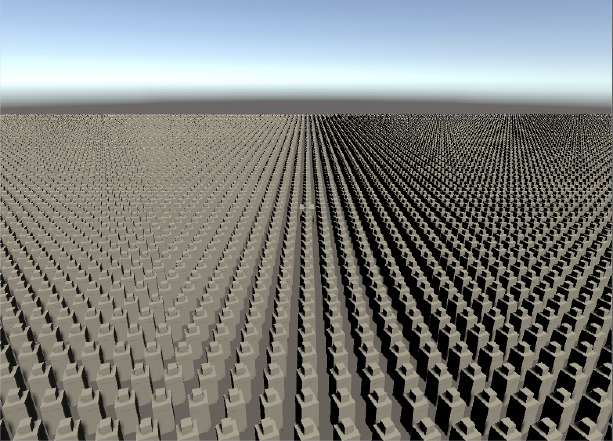
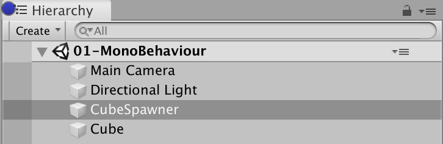
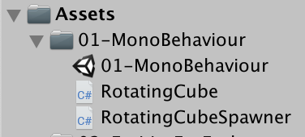
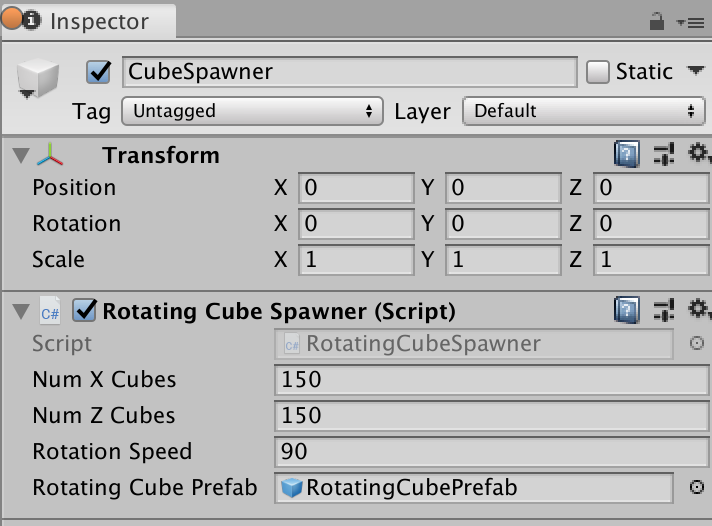
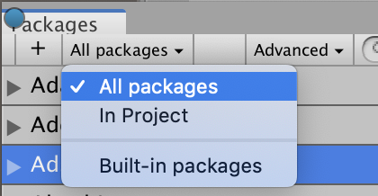
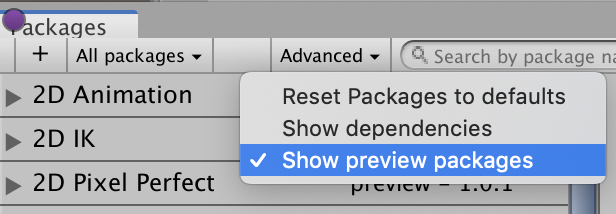

# Hello Cube DOTS Training Notes for the Instructor

This document serves as an instructional guide to introduce trainees to key Data Oriented Design (DOD) concepts and Unity's Data Oriented Technology Stack (DOTS) and the Entities API.  Along with this document is a Unity project designed to give the first hands on exposure to DOTS.  It is set up to walk through three ways of rotating a large number of cubes in Unity to illustrate how DOTS can be used in a small, self contained example.  Included are three scenes:

1. 01-MonoBehaviour
2. 02-EntitiesForEach
3. 03-IJobForEach

The intent is for you to start with the `01-MonoBehaviour` scene and code already completed and then modify the code toward the next version live in front of training participants and have them follow along on their own computers.  Wherever possible, the code has been commented to give more context and background.

The remainder of this document will describe in detail the recommended teaching sequence for this sample.

### Data Oriented Design
This is the **most crucial** concept to get across for the whole training.  It is not merely doing everything with arrays (although that tends to be the case since linear array accesses are fast) or using ECS; it's a higher level concept where you understand all of your input data and what transform must be done to get the desired output data.  Present the following problem to trainees:

> You want to rotate some cubes about the Y axis at a specified rotation rate.  The number of cubes to rotate is unknown, but it is reasonable to assume it can be any integer in the range [0, 100000]

All trainees should be asked to think about the rotating cube problem and be able to answer the following questions:

1. What is your input data?
2. What is your output data?
3. What transform must you do in order to generate the output data from the input data?
4. What is the minimum set of input/output for the problem?
5. What ranges of values do you expect for your inputs and outputs?

Trainees should not use arbitrary world modeling nouns.  For example, if a cube class is mentioned, they have failed.  They should be identifying concrete data that the computer must interact with to achieve the desired outcome.

Answers for this specific rotating cube problem:

> Inputs:
>
> 1. Rotation quaternions.
> 2. Delta time (single precision float).
> 3. Rotation rates (single precision float).
> 4. Number of cubes to rotate (integer).
>
> Outputs:
>
> 1. Rotation quaternions.
>
> (The above inputs and outputs are also minimal)
>
> Transformation:
>
> r = q * r, where q is the quaternion representing the rotation about the Y axis by (rotation rate * delta time) and r is the cube's current rotation quaternion.
>
> Expected input ranges:
>
> 1. Rotation quaternion.y will vary in range [-1, 1] and quaternion.w will vary in range [-1, 1].
> 2. Time is frame time, so we expect it to be in the range (0, 33.33] milliseconds, but the upper bound could be larger.
> 3. Rotation rate is constant, but it could vary with user input at edit time.
> 4. Number of cubes to rotate is [0, 100000] as given by problem statement.
>
> Expected output ranges:
>
> 1. Quaternion output range is same as input range.

Spend some time to go over trainee responses and compare with the given solutions.  After this is done, pose a question for trainees to think about:

> How do these answers change if this sample is modified to handle mouse input?  For example, the cubes should only rotate if the mouse is hovering over a cube (assume that hovering is determined by a sphere vs ray intersection or some other simple intersection test).

## 01-MonoBehaviour

This scene represents what everyone knows in Unity today.  Using GameObjects and MonoBehaviours, we spawn a number of cubes which will then rotate.  The Unity project already has the following packages installed but you should begin this exercise with them uninstalled (go to Window > Package Manager):

1. Entities.
2. Hybrid Renderer.

In the hierarchy, you will find a CubeSpawner and a Cube game object.  The CubeSpawner will perform the actual work of spawning the rotating cubes.  The Cube game object merely serves as positional reference for the camera and doesn't serve any functional purpose:

In the project, there should be a scene and two scripts:

You should start in `RotatingCubeSpawner.cs` and quickly explain how the CubeSpawner will spawn the rotating cubes.  After showing the cube spawning logic, go to `RotatingCube.cs` and show how the cube rotates around the Y axis.  At this point, you should reference data oriented design and the activity with inputs and outputs to the cube rotation problem.  Although the input and output data here is relatively easy to determine, point out that in a real game this function could be extremely complicated and finding that data could be difficult or time consuming.  This is one of the pitfalls of object oriented design: it doesn't focus on the data but on arbitrary abstractions that hide what the computer must actually do to compute results.

Parameters such as the number of cubes in the X axis, Z axis, and speed of rotation can be set on the CubeSpawner's `RotatingCubeSpawner` component:

This is a good opportunity to have trainees modify the number of cubes spawned to see how many cubes can be supported in Unity today.  For the remainder of this exercise, I will assume everyone is using the default values of `NumXCubes = 150` and `NumZCubes = 150` for a total of 22,500 cubes.  All trainees should enter play mode and open the Profiler to see how the performance breaks down:

About 80 milliseconds are spent on the CPU with about 27 milliseconds spent on update logic and the rest on CPU rendering logic.  The screenshot shows the highlighted portion which pertains specifically to BehaviourUpdate which takes nearly 21 milliseconds of time on the main thread.  Zero work is scheduled on the job threads while this is running.

You have reached the end of the material to be presented for this scene.

## 02-EntitiesForEach
This scene contains the first use of DOTS and the Entities API.  You should take the previous scene as the starting point and modify the code and assets to what you see in this scene, live in front of the trainees and have them follow along on their computers.

To start, have the trainees install the Entities and Hybrid Renderer packages.  Go to Window > Package Manager (you may need to show all packages and show preview packages):

