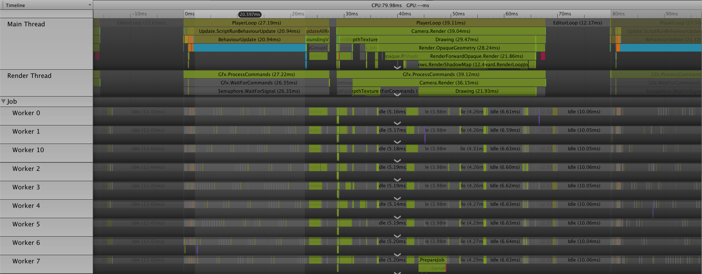

# Hello Cube DOTS Training Notes for the Instructor

This document serves as an instructional guide to introduce trainees to key Data Oriented Design (DOD) concepts and Unity's Data Oriented Technology Stack (DOTS) and the Entities API.  Along with this document is a Unity project designed to give the first hands on exposure to DOTS.  It is set up to walk through three ways of rotating a large number of cubes in Unity to illustrate how DOTS can be used in a small, self contained example.  Included are three scenes:

1. 01-MonoBehaviour
2. 02-EntitiesForEach
3. 03-IJobForEach

The intent is for you to start with the `01-MonoBehaviour` scene and code already completed and then modify the code toward the next version live in front of training participants and have them follow along on their own computers.  Wherever possible, the code has been commented to give more context and background.

The remainder of this document will describe in detail the recommended teaching sequence for this sample.

### Data Oriented Design
This is the **most crucial** concept to get across for the whole training.  It is not merely doing everything with arrays (although that tends to be the case since linear array accesses are fast) or using ECS; it's a higher level concept where you understand all of your input data and what transform must be done to get the desired output data.  Present the following problem to trainees:

> You want to rotate some cubes about the Y axis at a specified rotation rate.  The number of cubes to rotate is unknown, but it is reasonable to assume it can be any integer in the range [0, 100000]

All trainees should be asked to think about the rotating cube problem and be able to answer the following questions:

1. What is your input data?
2. What is your output data?
3. What transform must you do in order to generate the output data from the input data?
4. What is the minimum set of input/output for the problem?
5. What ranges of values do you expect for your inputs and outputs?

Trainees should not use arbitrary world modeling nouns.  For example, if a cube class is mentioned, they have failed.  They should be identifying concrete data that the computer must interact with to achieve the desired outcome.

Answers for this specific rotating cube problem:

> Inputs:
>
> 1. Rotation quaternions.
> 2. Delta time (single precision float).
> 3. Rotation rates (single precision float).
> 4. Number of cubes to rotate (integer).
>
> Outputs:
>
> 1. Rotation quaternions.
>
> (The above inputs and outputs are also minimal)
>
> Transformation:
>
> r = q * r, where q is the quaternion representing the rotation about the Y axis by (rotation rate * delta time) and r is the cube's current rotation quaternion.
>
> Expected input ranges:
>
> 1. Rotation quaternion.y will vary in range [-1, 1] and quaternion.w will vary in range [-1, 1].
> 2. Time is frame time, so we expect it to be in the range (0, 33.33] milliseconds, but the upper bound could be larger.
> 3. Rotation rate is constant, but it could vary with user input at edit time.
> 4. Number of cubes to rotate is [0, 100000] as given by problem statement.
>
> Expected output ranges:
>
> 1. Quaternion output range is same as input range.

Spend some time to go over trainee responses and compare with the given solutions.  After this is done, pose a question for trainees to think about:

> How do these answers change if this sample is modified to handle mouse input?  For example, the cubes should only rotate if the mouse is hovering over a cube (assume that hovering is determined by a sphere vs ray intersection or some other simple intersection test).

## 01-MonoBehaviour


This scene represents what everyone knows in Unity today.  Using GameObjects and MonoBehaviours, we spawn a number of cubes which will then rotate.  The Unity project already has the following packages installed but you should begin this exercise with them uninstalled (go to Window > Package Manager):

1. Entities.
2. Hybrid Renderer.

In the hierarchy, you will find a CubeSpawner and a Cube game object.  The CubeSpawner will perform the actual work of spawning the rotating cubes.  The Cube game object merely serves as positional reference for the camera and doesn't serve any functional purpose:


In the project, there should be a scene and two scripts:


You should start in `RotatingCubeSpawner.cs` and quickly explain how the CubeSpawner will spawn the rotating cubes.  After showing the cube spawning logic, go to `RotatingCube.cs` and show how the cube rotates around the Y axis.  At this point, you should reference data oriented design and the activity with inputs and outputs to the cube rotation problem.  Although the input and output data here is relatively easy to determine, point out that in a real game this function could be extremely complicated and finding that data could be difficult or time consuming.  This is one of the pitfalls of object oriented design: it doesn't focus on the data but on arbitrary abstractions that hide what the computer must actually do to compute results.

Parameters such as the number of cubes in the X axis, Z axis, and speed of rotation can be set on the CubeSpawner's `RotatingCubeSpawner` component:


This is a good opportunity to have trainees modify the number of cubes spawned to see how many cubes can be supported in Unity today.  For the remainder of this exercise, I will assume everyone is using the default values of `NumXCubes = 150` and `NumZCubes = 150` for a total of 22,500 cubes.  All trainees should enter play mode and open the Profiler to see how the performance breaks down:



About 80 milliseconds are spent on the CPU with about 27 milliseconds spent on update logic and the rest on CPU rendering logic.  The screenshot shows the highlighted portion which pertains specifically to BehaviourUpdate which takes nearly 21 milliseconds of time on the main thread.  Zero work is scheduled on the job threads while this is running.

You have reached the end of the material to be presented for this scene.

## 02-EntitiesForEach
This scene contains the first use of DOTS and the Entities API.  You should take the previous scene as the starting point and modify the code and assets to what you see in this scene, live in front of the trainees and have them follow along on their computers.  This guide will walk you through the recommended sequence to modify the previous scene into this one.  Take note: the code in this scene serves only as reference and the names of some structs and classes may differ from what is presented below.

### Installing DOTS packages
To start, have the trainees install the Entities and Hybrid Renderer packages.  Go to Window > Package Manager (you may need to show all packages and show preview packages):


### Converting CubeSpawner
We will begin by porting the cube spawning logic in `RotatingCubeSpawner.cs`.  The final ported code can be found in:

* `RotatingCubeSpawnerConverter_EntitiesForEach.cs`
* `RotatingCubeSpawnerSystem_EntitiesForEach.cs`

In `RotatingCubeSpawner.cs`, rename `RotatingCubeSpawnerConverter` (and rename the file if necessary) and make it also implement this interface:

* `IConvertGameObjectToEntity`

```
public class RotatingCubeSpawner : MonoBehaviour
```

becomes:

```
public class RotatingCubeSpawnerConverter : MonoBehaviour, IConvertGameObjectToEntity
```

In the editor, find the CubeSpawner game object and be sure it has a `Rotating Cube Spawner Converter` component and add a new `Convert To Entity` component:


(You may need to change the conversion mode to `Convert And Destroy`.  These conversion modes describe what must happen to the game object after conversion is performed.)

Adding the `Convert To Entity` component tells the Entities conversion system that this game object will be converted into an entity and as a result of implementing `IConvertGameObjectToEntity`, you will have to implement this function to describe what happens when the game object is converted:

```
    public void Convert(Entity entity, EntityManager dstManager, GameObjectConversionSystem conversionSystem)
    {
    }
```

`entity` is the Entity that was created by the conversion system for this object and you must interact with the EntityManager `dstManager` to create the appropriate components for the converted entity and the GameObjectConversionSystem `conversionSystem` to deal with prefab objects.  Implement `Convert()` as follows:

```
    public void Convert(Entity entity, EntityManager dstManager, GameObjectConversionSystem conversionSystem)
    {
        var rotatingCubePrefabEntity = conversionSystem.GetPrimaryEntity(RotatingCubePrefab);

        var cubeSpawnerData = new RotatingCubeSpawnerData
        {
            NumXCubes = NumXCubes,
            NumZCubes = NumZCubes,
            RotationSpeed = math.radians(RotationSpeed),
            RotatingCubePrefabEntity = rotatingCubePrefabEntity,
        };

        dstManager.AddComponentData(entity, cubeSpawnerData);
    }
```

This code will not compile since we have not yet defined `RotatingCubeSpawnerData`.  Define it now:

```
public struct RotatingCubeSpawnerData : IComponentData
{
    public int NumXCubes;
    public int NumZCubes;
    public float RotationSpeed;
    public Entity RotatingCubePrefabEntity;
}
```

We have defined our first component!  This component contains all the data necessary for the cube spawner to spawn cubes.  The conversion function should now compile and we can explain what it does to the trainees.  Recall that `entity` was created for us by the conversion system to represent the game object CubeSpawner.  Our conversion code takes the cube spawning data on the MonoBehaviour and puts it into component data and adds that component data to the entity so we know how many cubes will need to be spawned when we process this spawner entity later.  The one mystery is this line dealing with the prefab:

```
var rotatingCubePrefabEntity = conversionSystem.GetPrimaryEntity(RotatingCubePrefab);
```

Somehow, the conversion system should know about our `RotatingCubePrefab` and give us an entity.  But we haven't done anything yet that deals with this prefab, so the entity we get back is null.  Try running the code and breaking here:


To fix this, make `RotatingCubeSpawnerConverter` also implement `IDeclareReferencedPrefabs`:

```
public class RotatingCubeSpawnerConverter : MonoBehaviour, IConvertGameObjectToEntity, IDeclareReferencedPrefabs
```

Define this function:

```
    public void DeclareReferencedPrefabs(List<GameObject> referencedPrefabs)
    {
        referencedPrefabs.Add(RotatingCubePrefab);
    }
```

This makes the conversion system aware of the `RotatingCubePrefab` so it knows to create an entity version of that prefab.  When you execute the code now, you will get a valid entity back for the prefab:


We have now converted the CubeSpawner game object to an entity!

### Implementing CubeSpawner Logic with Entities.ForEach
The cube spawner is now an entity, but when you enter play mode, no cubes are spawned:


Trainees might be confused why no cubes are spawning but recall that we only made the cube spawner into an entity but never actually implemented the logic to create new cubes.  In order to make the cube spawner do something, we must implement a ComponentSystem which will operate on the entities that have a `RotatingCubeSpawnerData` component.  Create a new script file named `RotatingCubeSpawner` and define this class:

```
public class RotatingCubeSpawner : ComponentSystem
{
    protected override void OnUpdate()
    {
    }
}
```

Also define this component:

```
public struct RotationSpeed : IComponentData
{
    public float Value;
}
```

ComponentSystems are where you work with entities and components to implement your data transformations.  `OnUpdate()` is called every frame and runs on the main thread.  Fill in that function like so:

```
    protected override void OnUpdate()
    {
        Entities.ForEach((Entity entity, ref RotatingCubeSpawnerData spawnerData) =>
        {
            for (int x = 0; x < spawnerData.NumXCubes; ++x)
            {
                float posX = x - (spawnerData.NumXCubes / 2);

                for (int z = 0; z < spawnerData.NumZCubes; ++z)
                {
                    float posZ = z - (spawnerData.NumZCubes / 2);

                    var rotatingCubeEntity = EntityManager.Instantiate(spawnerData.RotatingCubePrefabEntity);

                    EntityManager.SetComponentData(rotatingCubeEntity, new Translation { Value = new float3(posX, 0.0f, posZ) });
                    EntityManager.AddComponentData(rotatingCubeEntity, new RotationSpeed { Value = spawnerData.RotationSpeed });
                }
            }

            EntityManager.DestroyEntity(entity);
        });
    }
```

`Entities.ForEach` is a convenient and easy API for working with ECS.  You just define a lambda with the components you're interested as inputs and the body should do the data transform you want.  In this case, we want to access every entity with a `RotatingCubeSpawnerData` component and spawn all the cubes.  The spawning of a cube is done with this line:

```
var rotatingCubeEntity = EntityManager.Instantiate(spawnerData.RotatingCubePrefabEntity);
```

To set the position of the newly instantiated cube, we set the `Translation` component:

```
EntityManager.SetComponentData(rotatingCubeEntity, new Translation { Value = new float3(posX, 0.0f, posZ) });
```

Finally, we add a new component of our own, `RotationSpeed` which will contain the radians per second each cube should rotate at:

```
EntityManager.AddComponentData(rotatingCubeEntity, new RotationSpeed { Value = spawnerData.RotationSpeed });
```

Most of this code should be straightforward to understand and mirrors the original MonoBehaviour logic.  The last line might be confusing:

```
EntityManager.DestroyEntity(entity);
```

Why are we destroying an entity?  Remember that the entity we are working with is the cube spawner entity.  If we don't destroy it, then on the second frame of the game, this system will run again since it sees an entity with a `RotatingCubeSpawnerData` on it still and will run the spawning logic.  By destroying the entity, we ensure the data for it doesn't exist so the system can't possibly run again on that entity.  This is a common way of running logic that should occur only once in ECS; create the data, have a system process it, and then destroy the data.  If there is no data, there is nothing to do!

You should now be spawning cubes, but no rotation will occur:

